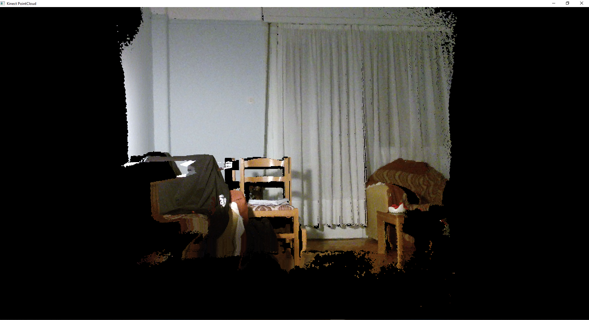
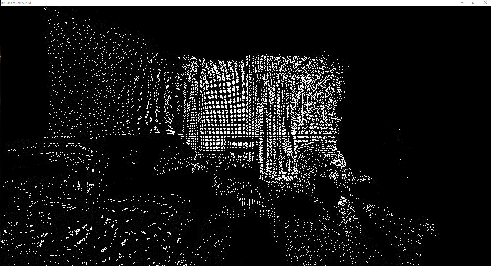
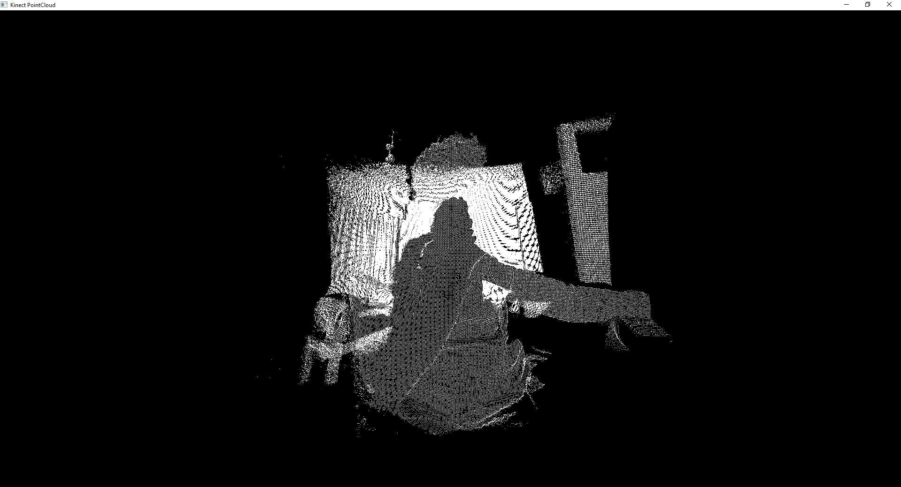
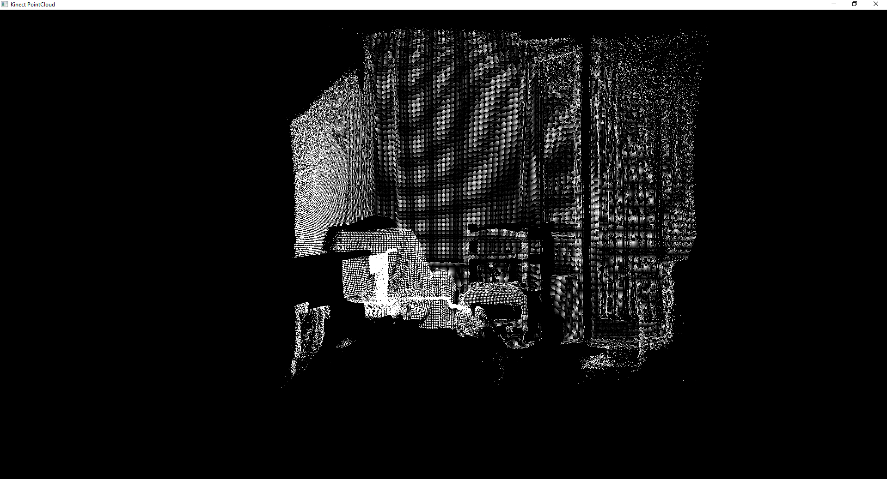
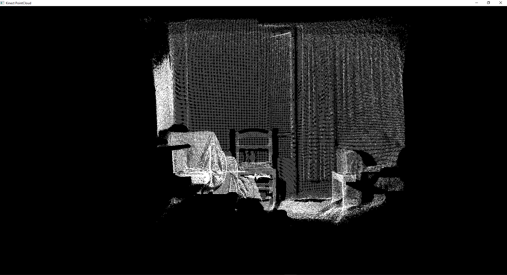
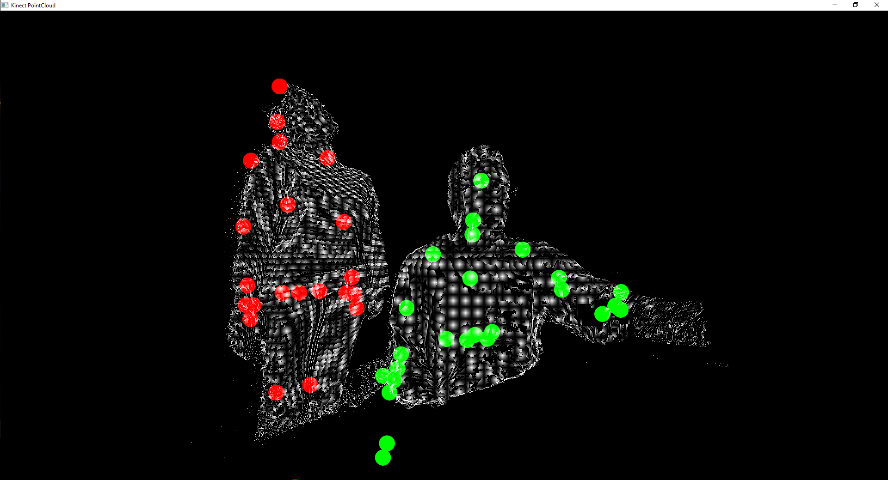
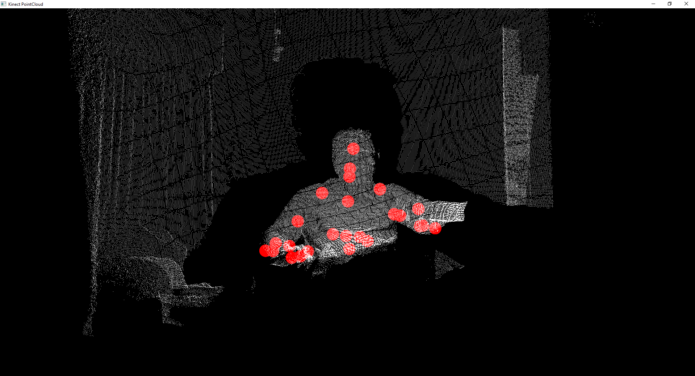

# PyKinect2-PyQtGraph-PointClouds
Creating real-time dynamic Point Clouds using PyQtGraph, Kinect 2 and the python library PyKinect2.

## Description
The PointCloud.py file contains the main class to produce dynamic Point Clouds using the [PyKinect2](https://github.com/Kinect/PyKinect2) and the [PyQtGraph](https://github.com/pyqtgraph/pyqtgraph) libraries.
The main file uses the numpy library that runs in C, thus it is fully optimized and can produce dynamic Point Clouds with up to 60+ frames, except for the point clouds produces by the RGB camera that run in 10+ frames.
The library can also be used to create a PointCloud and save it as a .txt file containing the world point coordinates as: 
x, y, z
   .
   .
   .
x, y, z
It can also be used to view .ply or .pcd point cloud files or create PointClouds and save them as .ply or .pcd files. Instructions on how to use the main file are written in the **Instructions** chapter.
In addition, there is a window with opencv track bars that can be used to dynamically change the color and the size of the points in the point cloud and the input flags.

## Requirements
Install all requirements using the following command:
```
pip install requirement
```
Full list of **all** requirements.
```
* pyqtgraph==0.10.0
* numpy==1.18.2
* pykinect2==0.1.0
* opencv-python==4.2.0.34
* open3d-python==0.7.0.0
* time (already installed with Python3)
* sys (already installed with Python3)
* os (already installed with Python3)
* ctypes (already installed with Python3)
```
Another dependecy is the [mapper](https://github.com/KonstantinosAng/PyKinect2-Mapper-Functions) file that I created and handles the ICoordanteMapper functions. Download the file and place it in the same directory as the PointCloud.py file. The main file is tested with [Python 3.6.8](https://www.python.org/downloads/release/python-368/).

## Instructions
First import the main class as:
```
from PointCloud import Cloud
```
For viewing a point cloud text file with:                                              
    x, y, z                                                                            
    ....                                                                               
    x, y, z                                                                            
(world point coordinates)                                                              
If the file with the name does not exists it will create a point cloud with kinect and save it to that file.txt. It can also view .pcd and .ply files. I have uploaded some pointcloud files in the models/ directory for testing purposes.
```
# viewing a .txt file
pcl = Cloud(file='models/test_cloud_4.txt')
pcl.visualize()

# viewing .ply or .pcd files
# .pcd or .ply files open with the Open3D library
pcl = Cloud(file='models/model.pcd')

pcl = Cloud(file='models/Car.ply')
```
If the files doesn't exist then you have to specify from which sensor camera you want the pointcloud to be created and saved with that file name.
The color point cloud is slower than the depth point cloud due to more points generated and written to the file.
```
# Creating a .txt PointCloud with the depth camera
pcl = Cloud(file='models/cloud_test_1.txt', depth=True)
pcl.visualize()

# Creating a .ply PointCloud with the depth camera
pcl = Cloud(file='models/cloud_test_1.ply', depth=True)

# Creating a .pcd PointCloud with the depth camera
pcl = Cloud(file='models/cloud_test_1.pcd', depth=True)

# Creating a .txt PointCloud with the color camera
pcl = Cloud(file='models/cloud_test_2.txt', color=True)
pcl.visualize()

# Creating a .ply PointCloud with the color camera
pcl = Cloud(file='models/cloud_test_3.ply', color=True)

# Creating a .pcd PointCloud with the color camera
pcl = Cloud(file='models/cloud_test_3.pcd', color=True)

```
For dynamically creating and viewing the PointCloud.
```
# rgb camera
pcl = Cloud(dynamic=True, color=True)
pcl.visualize()

# depth camera
pcl = Cloud(dynamic=True, depth=True)
pcl.visualize()

# body index
pcl = Cloud(dynamic=True, body=True)
pcl.visualize()

# skeleton cloud
pcl = Cloud(dynamic=True, skeleton=True)
pcl.visualize()
```
You can also visualize the clouds simultaneously in any order.
```
# example 1 with color and depth point clouds
pcl = Cloud(dynamic=True, simultaneously=True, color=True, depth=True, body=False, skeleton=False, color_overlay=False)
pcl.visualize()

# example 2 with all the point clouds enabled (scroll out to see the point cloud)
pcl = Cloud(dynamic=True, simultaneously=True, depth=True, color=True, body=True, skeleton=True, color_overlay=True)
pcl.visualize()

# example 3 with depth and body index point cloud
pcl = Cloud(dynamic=True, simultaneously=True, depth=True, color=False, body=True, skeleton=False, color_overlay=True)
pcl.visualize()
```

In addition, there is a window with trackbars to change the input flags, the color and point size of the cloud without closing the app.

## Examples
Run the main file, to see the functionality, as:
```
python PointCloud.py
```
<p align="center">







</p>
